# AI-Powered Mock Interview System

## Overview

This is a comprehensive AI-powered mock interview system designed to simulate real-world job interviews. The system supports multiple interview modes including standard text-based interviews, conversational AI interviewer agents, and FAANG-style video interviews with camera access. It leverages OpenAI's GPT models for intelligent question generation, response evaluation, feedback, and conversational interactions.

## Features

- **Resume Upload and Parsing**: Upload PDF resumes and parse them for key information
- **Job Role Selection**: Choose from predefined job roles or create custom ones
- **Multiple Interview Modes**:
  - Standard Interview: Traditional Q&A with AI evaluation
  - Agent Interview: Conversational AI interviewer that adapts questions
  - Video Interview: FAANG-style one-on-one video interview with camera access
- **AI-Powered Evaluation**: Automatic scoring and detailed feedback reports
- **Resume Shortlisting**: AI analysis for candidate shortlisting (Eightfold AI-style)
- **Real-time Feedback**: Instant evaluation during interviews
- **Database Storage**: Persistent storage of interviews, responses, and feedback

## Architecture Diagram

```mermaid
flowchart LR
    %% Pipeline Stages
    Start([🚀 Start]) --> Upload[📄 Upload Resume]
    Upload --> Parse[🔍 Parse Resume<br/>Extract Data]
    Parse --> Select[🎯 Select Interview<br/>Mode]
    
    Select --> Standard{📝 Standard<br/>Interview}
    Select --> Agent{🤖 Agent<br/>Interview}
    Select --> Video{📹 Video<br/>Interview}
    
    Standard --> GenQuestions[🧠 Generate<br/>Questions]
    Agent --> StartChat[💬 Start<br/>AI Chat]
    Video --> InitCamera[📷 Initialize<br/>Camera]
    
    GenQuestions --> AskQuestion[❓ Ask Question]
    StartChat --> ChatLoop[🔄 Chat with<br/>AI Agent]
    InitCamera --> VideoChat[🎥 Video Chat<br/>with Agent]
    
    AskQuestion --> UserAnswer[✍️ User<br/>Answers]
    ChatLoop --> UserMessage[💭 User<br/>Messages]
    VideoChat --> UserVideo[🎤 User Speaks<br/>& Types]
    
    UserAnswer --> Evaluate[⚖️ Evaluate<br/>Answer]
    UserMessage --> ProcessChat[🧠 Process<br/>Chat]
    UserVideo --> ProcessVideo[🧠 Process Video<br/>& Audio]
    
    Evaluate --> StoreResult[💾 Store<br/>Result]
    ProcessChat --> StoreChat[💾 Store<br/>Chat]
    ProcessVideo --> StoreVideo[💾 Store<br/>Video Data]
    
    StoreResult --> MoreQuestions{More<br/>Questions?}
    StoreChat --> ContinueChat{Continue<br/>Chat?}
    StoreVideo --> ContinueVideo{Continue<br/>Video?}
    
    MoreQuestions -->|Yes| AskQuestion
    ContinueChat -->|Yes| ChatLoop
    ContinueVideo -->|Yes| VideoChat
    
    MoreQuestions -->|No| GenerateReport[📊 Generate<br/>Feedback Report]
    ContinueChat -->|No| GenerateReport
    ContinueVideo -->|No| GenerateReport
    
    GenerateReport --> DisplayResults[📈 Display<br/>Results]
    DisplayResults --> End([🏁 End])
    
    %% Styling
    classDef startEnd fill:#e8f5e8,stroke:#2e7d32,stroke-width:3px
    classDef process fill:#e3f2fd,stroke:#1976d2,stroke-width:2px
    classDef decision fill:#fff3e0,stroke:#f57c00,stroke-width:2px
    classDef storage fill:#f3e5f5,stroke:#7b1fa2,stroke-width:2px
    
    class Start,End startEnd
    class Upload,Parse,Select,GenQuestions,AskQuestion,UserAnswer,Evaluate,StoreResult,GenerateReport,DisplayResults,StartChat,ChatLoop,UserMessage,ProcessChat,StoreChat,InitCamera,VideoChat,UserVideo,ProcessVideo,StoreVideo process
    class Standard,Agent,Video,MoreQuestions,ContinueChat,ContinueVideo decision
```



## Technologies and Tools Used

### Core Technologies
- **Python 3.14**: Primary programming language
- **Django 4.2.8**: Backend web framework for API development
- **Streamlit 1.29.0**: Frontend framework for interactive web applications
- **Django REST Framework**: For building RESTful APIs
- **SQLite**: Default database for data persistence

### AI and ML Tools
- **OpenAI API (GPT-3.5-turbo)**: For AI-powered question generation, response evaluation, feedback, shortlisting, and conversational interviewing
- **PyPDF2**: For parsing PDF resumes
- **SpeechRecognition**: For audio processing in video interviews

### Video and Real-time Tools
- **streamlit-webrtc 0.47.0**: For WebRTC-based video streaming and camera access
- **tornado 6.5.5**: Web server for WebRTC functionality
- **aiortc**: WebRTC and ORTC library for Python
- **aiohttp**: Asynchronous HTTP client/server
- **pydantic**: Data validation and settings management

### Additional Libraries
- **requests**: For making HTTP API calls
- **python-dotenv**: For environment variable management
- **Pillow**: Image processing for resume parsing
- **django-cors-headers**: For handling CORS in Django

## AI Integrations

The system integrates OpenAI's GPT-3.5-turbo model through the `ai_service.py` module:

1. **Question Generation**: Creates relevant interview questions based on job role and resume analysis
2. **Response Evaluation**: Scores candidate responses on a scale and provides detailed feedback
3. **Feedback Reports**: Generates comprehensive interview feedback with strengths, weaknesses, and improvement suggestions
4. **Resume Shortlisting**: Analyzes resumes for job fit and provides shortlisting recommendations
5. **Conversational Interviewing**: Powers the AI interviewer agent that adapts questions based on responses
6. **Video Interview Processing**: Processes real-time video interview data for evaluation

All AI interactions use the OpenAI ChatCompletion API with structured prompts for consistent results.

## Frontend Details

The frontend is built with Streamlit and consists of multiple pages:

- **Main App (app.py)**: Entry point with navigation and resume upload functionality
- **Start Interview (start_interview.py)**: Interview mode selection and job role setup
- **Conduct Interview (conduct_interview.py)**: Standard text-based interview interface
- **Agent Interview (agent_interview.py)**: Conversational AI interviewer interface
- **Video Interview (video_interview.py)**: FAANG-style video interview with camera access
- **Interview Feedback (interview_feedback.py)**: Displays evaluation results and feedback

The frontend communicates with the backend via REST API calls using the `requests` library.

## Backend Details

The backend is a Django application with the following structure:

- **API Layer**: REST endpoints for CRUD operations on interviews, resumes, and feedback
- **Core Services**: AI service integration and resume parsing
- **Models**: Database schema for storing interview data
- **Admin Interface**: Django admin for data management

Key components:
- `views.py`: API endpoints and business logic
- `ai_service.py`: OpenAI integration for AI features
- `resume_parser.py`: PDF parsing and text extraction
- `models.py`: Database models for data persistence

## API Calls

The system uses RESTful API calls between frontend and backend:

### Resume Management
- `POST /api/resumes/`: Upload and parse resume PDF
- `GET /api/resumes/{id}/`: Retrieve resume details
- `GET /api/resumes/{id}/shortlist/`: Get AI shortlisting analysis

### Interview Management
- `POST /api/interviews/`: Create new interview
- `GET /api/interviews/{id}/`: Get interview details
- `POST /api/interviews/{id}/start_agent_interview/`: Start conversational AI interview
- `POST /api/interviews/{id}/agent_chat/`: Send message to AI interviewer
- `POST /api/interviews/{id}/submit_response/`: Submit interview response
- `GET /api/interviews/{id}/feedback/`: Get interview feedback

### Job Roles
- `GET /api/job-roles/`: List available job roles
- `POST /api/job-roles/`: Create custom job role

API calls are made using the `requests` library with JSON payloads and proper error handling.

## Video Integration

Video functionality is implemented using `streamlit-webrtc`:

1. **Camera Access**: Uses `webrtc_streamer()` to access user's camera and microphone
2. **Real-time Streaming**: WebRTC protocol for low-latency video streaming
3. **Split-screen Layout**: Displays user video alongside AI interviewer interface
4. **Audio Processing**: Integrates with SpeechRecognition for audio analysis
5. **Backend Processing**: Video data is processed through API calls for AI evaluation

The video interview page (`video_interview.py`) handles WebRTC streaming while maintaining chat functionality with the AI interviewer.

## Database Connection

The system uses Django's default SQLite database:

- **Connection**: Automatic through Django's ORM
- **Models**: 
  - `JobRole`: Stores job role information
  - `Resume`: Stores parsed resume data
  - `Interview`: Stores interview sessions
  - `InterviewQuestion`: Stores generated questions
  - `InterviewResponse`: Stores candidate responses
  - `InterviewFeedback`: Stores evaluation results

Database operations are handled through Django's ORM with automatic migrations.

## Installation and Setup

### Prerequisites
- Python 3.11 or higher
- OpenAI API key

### Backend Setup
```bash
cd backend
python -m venv venv
venv\Scripts\activate  # On Windows
pip install -r requirements.txt
python manage.py migrate
python manage.py runserver
```

### Frontend Setup
```bash
cd frontend
python -m venv venv
venv\Scripts\activate  # On Windows
pip install -r requirements.txt
streamlit run app.py
```

### Environment Configuration
Create `.env` file in backend directory:
```
OPENAI_API_KEY=your_api_key_here
```

## Usage

1. Start the backend server on port 8000
2. Start the frontend on port 8501
3. Upload a resume and select interview mode
4. Conduct interview and receive AI-powered feedback

## Contributing

Please read CONTRIBUTING.md for details on our code of conduct and the process for submitting pull requests.

## License

This project is licensed under the MIT License - see the LICENSE file for details.

#### Submit Response
```bash
POST /api/interviews/{id}/submit_response/
Content-Type: application/json

{
    "question_id": 1,
    "response_text": "Your answer here...",
    "delivery_method": "text"
}
```

Response:
```json
{
    "overall_score": 78.5,
    "relevance_score": 8,
    "completeness_score": 7,
    "technical_depth_score": 8,
    "communication_score": 8,
    "experience_score": 7,
    "strengths": ["Good explanation", "Technical accuracy"],
    "areas_for_improvement": ["Could be more concise"],
    "feedback": "Your response demonstrates good understanding...",
    "follow_up_question": "Can you elaborate on..."
}
```

## Configuration

### Environment Variables

#### Backend (.env)
```env
SECRET_KEY=your-secret-key
DEBUG=False
ALLOWED_HOSTS=localhost,127.0.0.1
OPENAI_API_KEY=your-openai-api-key
DATABASE_URL=sqlite:///db.sqlite3
```

#### Frontend (.env)
```env
API_BASE_URL=http://localhost:8000/api
OPENAI_API_KEY=your-openai-api-key
DEBUG=False
```

## Usage Workflow

1. **Access the Platform**: Open Streamlit at `http://localhost:8501`
2. **Upload Resume**: Upload your PDF resume to extract skills and experience
3. **Select Job Role**: Choose from available job roles
4. **Start Interview**: Begin a mock interview session
5. **Answer Questions**: Respond to AI-generated questions
6. **Receive Feedback**: Get immediate evaluation and suggestions
7. **Review Report**: Check comprehensive feedback and progress

## Advanced Features

### Customization

#### Adding Job Roles
Use Django admin (`/admin`) to add new job roles:
1. Log in with superuser credentials
2. Navigate to Job Roles
3. Add new roles with descriptions and required skills

#### Modifying AI Behavior
Edit `backend/interview_system/core/ai_service.py` to:
- Change prompt templates
- Adjust model parameters
- Implement custom evaluation logic

### Database

#### Backup & Restore
```bash
# Backup
python manage.py dumpdata > backup.json

# Restore
python manage.py loaddata backup.json
```

## Troubleshooting

### OpenAI API Errors
- Verify API key is correct in `.env`
- Check API usage limits in OpenAI dashboard
- Ensure sufficient credits

### Connection Errors
- Ensure backend is running: `python manage.py runserver`
- Check API_BASE_URL in frontend `.env`
- Verify CORS settings in Django

### Resume Upload Issues
- Ensure file is valid PDF
- Check file size (recommended < 5MB)
- Try uploading as text if PDF fails

## Deployment

### Production Checklist
- [ ] Set `DEBUG=False` in settings
- [ ] Configure proper SECRET_KEY
- [ ] Use PostgreSQL instead of SQLite
- [ ] Set up proper authentication
- [ ] Configure HTTPS
- [ ] Deploy to cloud platform (AWS, Azure, GCP)
- [ ] Set up automated backups
- [ ] Configure monitoring and logging

### Docker Deployment (Coming Soon)
Dockerfile and docker-compose.yml templates will be added soon.

## Future Enhancements

- 🎙️ Real-time speech recognition for audio responses
- 📹 Video recording and analysis
- 🌍 Multi-language support
- 👥 Peer comparison and benchmarking
- 📧 Email reports and progress notifications
- 🔐 User authentication and profiles
- 📱 Mobile app support
- 🌐 Real-time interview with human interviewer integration

## Contributing

Contributions are welcome! Please follow these steps:
1. Fork the repository
2. Create a feature branch
3. Make your changes
4. Submit a pull request

## License

This project is licensed under the MIT License - see LICENSE file for details.

## Support

For issues and questions:
- 📧 Email: support@mockinterview.ai (Coming Soon)
- 📝 Issues: GitHub Issues
- 💬 Discussions: GitHub Discussions

## Credits

Built with ❤️ to help students and professionals prepare for interviews.

---

**Last Updated**: May 5, 2026
**Version**: 1.0.0
